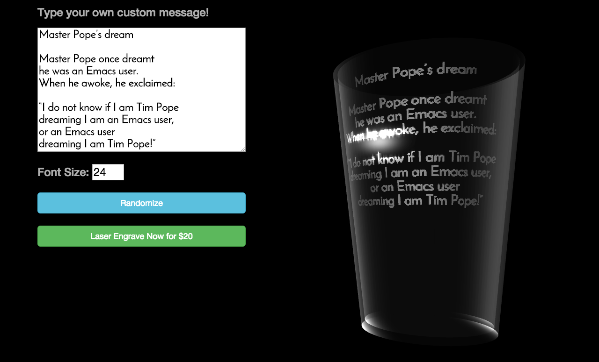

Google Fonts WebGL Mashup

See it live at http://freewillworkshop.org

This is a simple Flask app that serves up a page that requests fonts from the Google Font API.

Those fonts are rendered into a texture, and used in a 3D scene.

I fiddled with the shaders to come up with a nice glass effect.

See Also:
http://learningwebgl.com/blog/?page_id=1217
http://delphic.me.uk/webgltext.html
